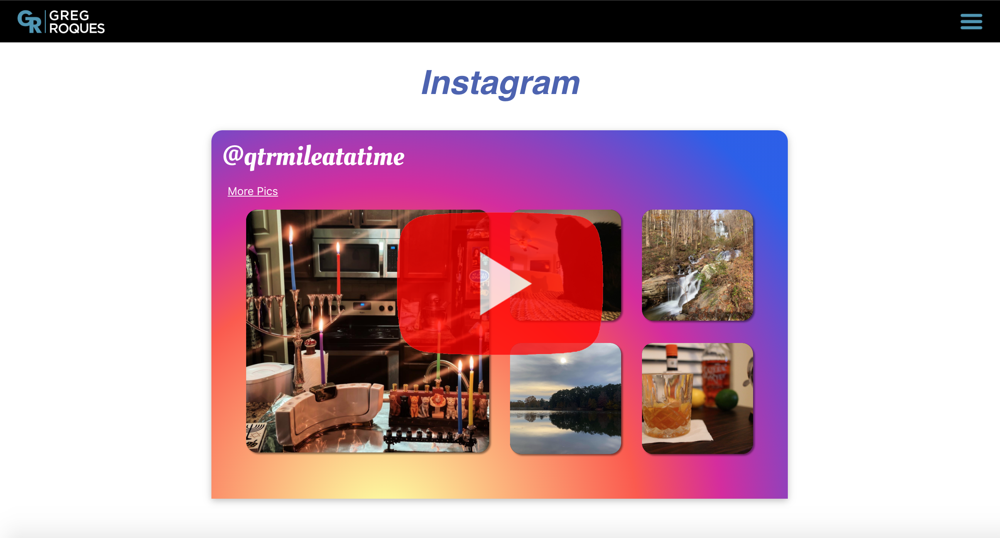

# Personal Portfolio Site

# Description
Revamped personal website (www.GregRoques.com).

# Technologies
- React
- Node/Express
- HTML/CSS/JavaScript

## Ignored Files
### Front-end – Dependency Folder:
- BackendAPI.js
    - Includes grAPI (to access backend)
    - trackingID (for Google Analytics)

### Back-end – Util Folder
- insta.js (link to access Instagram long term token and token's expiration date)
- linkedInList.js (currated list of LinkedIn recommendations)

# Website Demo Video

## New (Current) Website

# Instagram Video – How To

In the below video, I discuss the functionality of an Instagram widget I created for my photography page, including how to generate a long term token granting access to your Instagram account's user and media information using Facebook for Developers. 

While I have included the widget in my project's build, I am unsure if I will activate it. I am not doing freelance photography these days (new city, pandemic, etc.) and have set my privacy settings to private (Instagram only grants valid tokens to public accounts). More on all this in the video below.

