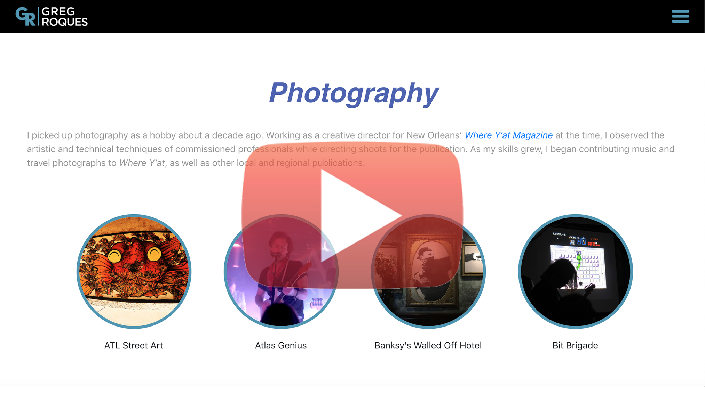

# Personal Portfolio Site

# Description
Revamped personal website (www.GregRoques.com).

# Technologies
- React
- Node/Express
- HTML/CSS/JavaScript

## Ignored Files
### Front-end – Dependency Folder:
- BackendAPI.js
    - Includes grAPI (to access backend)
    - trackingID (for Google Analytics)

### Back-end – Util Folder
- insta.js (link to access Instagram long term token and token's expiration date)
- linkedInList.js (currated list of Instagram recommendations)
- sendGripApi.js (sendGripApi key ... used to email me when Instagram key has almost expired)

# Demo Video
## Click image below to view video

  
