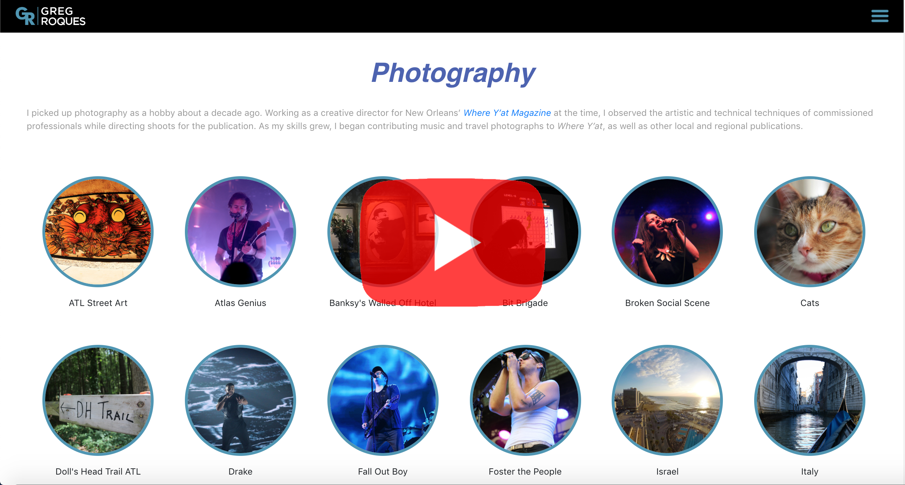

# Personal Portfolio Site

# Description
Revamped personal website (www.GregRoques.com).

# Technologies
- React
- Node/Express
- HTML/CSS/JavaScript

## Ignored Files
### Front-end – Dependency Folder:
- BackendAPI.js
    - Includes grAPI (to access backend)
    - trackingID (for Google Analytics)
```
export const grAPI = "MY_WEBSITE"
export const trackingId = "MY_GOOGLE_ANALYTICS_TRACKING_ID";
```

### Back-end – Util Folder
- instaToken.json (link to access Instagram long term token and token's expiration date); structure looks like this:
```
{
  "access_token": "STRING",
  "token_type": "bearer",
  "expires_in_five_days": INTEGER (time in milliseconds),
  "is_expired": INTEGER (time in milliseconds)
}
```

- linkedInList.js (currated list of LinkedIn recommendations)
```
[
  {
    name: "STRING",
    title: "STRING",
    workedWith: "STRING",
    recommendation: "STRING",
  },
    etc.
]  
```

# Website Demo Video

[](https://youtu.be/mXTeQFUmI1E)